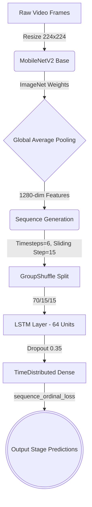

  
# 🔬 Embryo Morphokinetic Parameter Prediction

*A sequence-aware deep learning pipeline to predict the morphokinetic developmental stages of human embryos from time-lapse imaging videos.*

---

## 📑 Table of Contents
- [Project Overview](#-project-overview)
- [Dataset Description](#-dataset-description)
- [Architecture & Pipeline](#-architecture--pipeline)
- [Custom Ordinal Loss Function](#-custom-ordinal-loss-function)
- [References](#-references)

---

## 🚀 Project Overview

Predicting morphokinetic parameters is crucial for analyzing embryo quality in IVF (In Vitro Fertilization) treatments. Due to the temporal and sequential nature of biological development, this architecture relies on a frozen spatial feature extractor ([MobileNetV2](https://arxiv.org/abs/1801.04381)) linked with a powerful sequence learning temporal model (**LSTM**). 

This repository analyzes time-lapse imagery to predict and map morphological events progressively over time.

---

## 📂 Dataset Description

The dataset used in this project is sourced from a collection of time-lapse embryo videos and annotations publicly available via [Zenodo](https://zenodo.org/records/6390798).

- [**Images (Dataset)**](https://zenodo.org/records/6390798/files/embryo_dataset.tar.gz): Contains the raw frames of embryo development.
- [**Annotations**](https://zenodo.org/records/6390798/files/embryo_dataset_annotations.tar.gz): Contains the sequence bounds (start and end frames) for each specific developmental stage.

### 🧬 Developmental Stages

The sequence comprises **16 strictly ordinal stages** of embryo cell development. The network aims to predict the following stages in their natural biological order:

| Stage Code | Description | Stage Code | Description |
| :---: | :--- | :---: | :--- |
| `pPB2` | Extrusion of 2nd Polar Body | `p7` | 7-cell stage |
| `pPNa` | Appearance of pronuclei | `p8` | 8-cell stage |
| `pPNf` | Fading of pronuclei | `p9+` | 9+ cell stage |
| `p2` | 2-cell stage | `pM` | Morula formation |
| `p3` | 3-cell stage | `pSB` | Start of blastulation |
| `p4` | 4-cell stage | `pB` | Full blastocyst |
| `p5` | 5-cell stage | `pEB` | Expanded blastocyst |
| `p6` | 6-cell stage | `pHB` | Hatching blastocyst |

---

## ⚙️ Architecture & Pipeline

The pipeline transforms raw video sequences into distinct stage predictions by breaking the problem into spatial understanding and temporal awareness.

### 1. Feature Extraction (CNN)
We utilize a pre-trained **MobileNetV2** base with a `GlobalAveragePooling2D` block to convert the `224x224x3` embryo images into abstract `1280-dimensional` spatial feature vectors. The CNN weights are frozen to prevent catastrophic forgetting and to speed up processing. Features are cached to disk as `.npz` for rapid iteration.

### 2. Sequence Building and Data Splitting
Since developmental phases rely entirely on the element of *time*, frames cannot be treated as isolated images. 
- Continuous spatial features are grouped into sequential windows (`TIMESTEPS = 6`, `SLIDING_WINDOW = 15`).
- The dataset undergoes a **Train/Val/Test** split (`70/15/15`). We use `GroupShuffleSplit` on the patient/video IDs to guarantee zero data leakage between sets.

### 3. Temporal Model Training
- A Recurrent Neural Network (LSTM) receives the sequences.
- `return_sequences=True` maps predictions to every individual frame, rather than just the final frame.
- Overfitting is mitigated via **Dropout (35%)**, `EarlyStopping`, and automated learning rate decay (`ReduceLROnPlateau`).

---

## 🧠 Custom Ordinal Loss Function

A major technical challenge in this problem is dealing with standard cross-entropy loss. In traditional classification, Neural Networks treat every mistake equally. Predicting a `2-cell stage` as a `3-cell stage` receives the same penalty as predicting it as a `Hatching Blastocyst (pHB)`. 

Because embryo stages are strictly **ordinal** (they occur in a definite order), being "slightly wrong" is vastly preferred to being "completely wrong". 

To address this, we use the custom `sequence_ordinal_loss`:

> **Loss Calculation Formula:**
> `Total Loss` = `Base CCE` + (`Penalty Weight` * `Distance Penalty`)

1. **Base Error:** Calculates the standard Sparse Categorical Cross-Entropy.
2. **Expected Prediction:** Computes the 'average predicted stage index' via dot product of softmax probabilities and stage indices.
3. **Squared Distance Penalty:** Subtracts the true mathematical stage index from the predicted expected index, squaring the difference.
4. **Weighted Output:** Blends the CCE cross-entropy with the distance penalty. 

*Result: The network dynamically punishes predictions that are temporally absurd, massively improving contextual awareness.*

---

## 📚 References

1. MobileNetV2 Paper: Sandler, M., Howard, A., Zhu, M., Zhmoginov, A., & Chen, L. C. (2018). *MobileNetV2: Inverted Residuals and Linear Bottlenecks*. [arXiv:1801.04381](https://arxiv.org/abs/1801.04381).
2. Keras LSTMs: [TensorFlow Core Documentation](https://www.tensorflow.org/api_docs/python/tf/keras/layers/LSTM)
3. Dataset Citation: [Embryo Dataset on Zenodo](https://zenodo.org/records/6390798).

---

  <i>Developed for sequence-based Morphokinetic analysis.</i>

